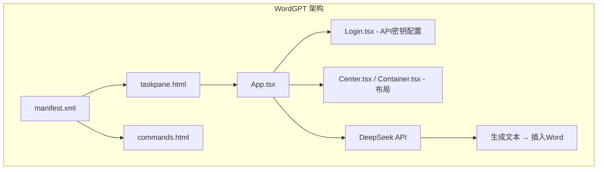

# WordGPT 项目代码审查报告

> 审查日期: 2026-07-07  
> 项目: WordGPT - DeepSeek AI Office Word 插件

---

## 目录

1. [项目概况](#1-项目概况)
2. [严重问题 (Critical)](#2-严重问题-critical)
3. [代码质量 (Code Quality)](#3-代码质量-code-quality)
4. [构建配置 (Build Config)](#4-构建配置-build-config)
5. [优化计划](#5-优化计划)

---

## 1. 项目概况



这是一个 Office Word 插件，通过 DeepSeek API 提供 AI 写作辅助功能。整体架构清晰，使用 React 17 + Fluent UI 8 构建。

---

## 2. 严重问题 (Critical)

### 2.1 缺失依赖: `axios`

**文件**: [`App.tsx:3`](/src/taskpane/components/App.tsx:3)  
**问题**: 代码中 `import axios from "axios"`，但 [`package.json`](package.json) 的 `dependencies` 中未包含 `axios`。  
**影响**: `npm install` 后运行会报模块找不到的错误。

### 2.2 错误的 DeepSeek 模型名称

**文件**: [`App.tsx:59`](/src/taskpane/components/App.tsx:59)  
**问题**: 使用了 `"deepseek-v4-flash"`，这不是 DeepSeek 官方发布的模型名称。  
**修正**: 应改为 `"deepseek-chat"`（通用对话模型）。

### 2.3 重复/缺失的依赖

| 包名 | 问题 |
|------|------|
| `react-icons` | 在 `dependencies` 中但代码中从未使用 |
| `react-hot-loader` | 在代码和 webpack 配置中使用，但仅在 `devDependencies` 中缺失 |
| `@types/react-hot-loader` | 未使用（类型已内置），但仍存在于 `devDependencies` |

---

## 3. 代码质量 (Code Quality)

### 3.1 catch 语句使用 `any` 类型

**文件**: [`App.tsx:78`](/src/taskpane/components/App.tsx:78)

```typescript
} catch (error: any) {
```

**问题**: 使用 `any` 会丢失 TypeScript 类型保护。  
**改进**: 使用 `unknown` + 类型守卫 (`AxiosError` / `Error`)。

### 3.2 `onCopy` 缺少错误处理

**文件**: [`App.tsx:103-105`](/src/taskpane/components/App.tsx:103)

```typescript
const onCopy = async () => {
  navigator.clipboard.writeText(generatedText);
};
```

**问题**: `writeText()` 返回 Promise，未 `await`/`catch`。剪贴板写入可能因权限问题失败。

### 3.3 `onInsert` 缺少错误处理

**文件**: [`App.tsx:95-101`](/src/taskpane/components/App.tsx:95)

**问题**: `Word.run()` 中插入文本的异步操作没有 try/catch 包裹，出错时会导致未处理的 Promise rejection。

### 3.4 API 响应数据缺少空值安全检查

**文件**: [`App.tsx:73`](/src/taskpane/components/App.tsx:73)

```typescript
setGeneratedText(response.data.choices[0].message.content);
```

**问题**: 没有检查 `response.data?.choices?.[0]?.message?.content` 是否为空。

### 3.5 `index.html` 中 href 链接换行断裂

**文件**: [`index.html:13-14`](index.html:13-14)

```html
<a href="
https://github.com/Sunnyliu2025/WordGPT"
```

**问题**: href 属性值跨行，会包含换行符导致 URL 解析错误。

---

## 4. 构建配置 (Build Config)

### 4.1 TypeScript 配置

**文件**: [`tsconfig.json`](tsconfig.json)

| 配置项 | 当前值 | 建议 | 理由 |
|--------|--------|------|------|
| `target` | `es5` | `es6`/`es2015` | Excel/Office 插件最低支持 Edge WebView，无需 ES5 |
| `noUnusedLocals` | 未设置 | `true` | 与 `noUnusedParameters` 保持一致 |
| `removeComments` | `false` | `true`（生产构建） | 减少产物体积 |
| `outDir` | `dist` | 移除（由 webpack 控制） | webpack 已有 `clean: true` |

### 4.2 Webpack 配置

**文件**: [`webpack.config.js`](webpack.config.js)

- **Vendor chunk 优化**: 当前将 `react`, `react-dom`, `core-js`, `@fluentui/react` 全部打包为一个 vendor 文件，建议使用 `splitChunks.cacheGroups` 更精细划分
- **`react-hot-loader` 整合**: 生产环境下应排除 HMR 相关代码
- **CSS 文件命名**: 使用 `[contenthash]` 很好，但建议添加 `[name]` 前缀明确标识

### 4.3 Browserslist

**文件**: [`package.json`](package.json)

```json
"browserslist": ["ie 11"]
```

**问题**: 只针对 IE 11，但 Office Web Add-in 已不再支持 IE。建议添加 `"last 2 versions"`。

---

## 5. 优化计划

### 阶段 1: 修复阻塞性 Bug（已部分完成）

| # | 文件 | 修改内容 | 状态 |
|---|------|----------|------|
| 1.1 | [`package.json`](package.json) | 添加 `axios` 依赖 | ✅ 已完成 |
| 1.2 | [`package.json`](package.json) | 移动 `react-hot-loader` 到 `devDependencies` | ✅ 已完成 |
| 1.3 | [`package.json`](package.json) | 移除未使用的 `react-icons` | ✅ 已完成 |
| 1.4 | [`package.json`](package.json) | 添加 `@hot-loader/react-dom` 提升 HMR 性能 | ✅ 已完成 |
| 1.5 | [`package.json`](package.json) | 更新 `browserslist` | ✅ 已完成 |

### 阶段 2: 修复 App.tsx 核心逻辑

| # | 文件 | 修改内容 | 优先级 |
|---|------|----------|--------|
| 2.1 | [`App.tsx:3`](/src/taskpane/components/App.tsx:3) | `import axios` → `import axios, { AxiosError }` | 高 |
| 2.2 | [`App.tsx:59`](/src/taskpane/components/App.tsx:59) | 模型名 `deepseek-v4-flash` → `deepseek-chat` | 高 |
| 2.3 | [`App.tsx:78`](/src/taskpane/components/App.tsx:78) | `catch (error: any)` → `catch (err: unknown)` + 类型守卫 | 高 |
| 2.4 | [`App.tsx:73`](/src/taskpane/components/App.tsx:73) | 添加空值安全检查 | 高 |
| 2.5 | [`App.tsx:95-101`](/src/taskpane/components/App.tsx:95) | `onInsert` 添加 try/catch | 中 |
| 2.6 | [`App.tsx:103-105`](/src/taskpane/components/App.tsx:103) | `onCopy` 添加 await + catch | 中 |
| 2.7 | [`App.tsx`](/src/taskpane/components/App.tsx) | 提取常量（API URL、模型名、最大长度） | 低 |

### 阶段 3: 清理冗余代码

| # | 文件 | 修改内容 | 优先级 |
|---|------|----------|--------|
| 3.1 | [`global.d.ts`](/src/taskpane/components/global.d.ts) | 删除空文件（`dom` lib 已在 tsconfig 中） | 低 |
| 3.2 | [`initializeIcons.ts`](/src/taskpane/components/initializeIcons.ts) | 移除全局 `window.iconsInitialized` 污染 | 低 |
| 3.3 | [`indel.html:13-14`](index.html:13-14) | 修复 href 换行 | 中 |

### 阶段 4: 构建配置优化

| # | 文件 | 修改内容 | 优先级 |
|---|------|----------|--------|
| 4.1 | [`tsconfig.json`](tsconfig.json) | `target: "es5"` → `"es2015"` | 中 |
| 4.2 | [`tsconfig.json`](tsconfig.json) | 添加 `noUnusedLocals: true` | 低 |
| 4.3 | [`webpack.config.js`](webpack.config.js) | 优化 splitChunks 配置 | 低 |

### 优化前后的文件结构对比

```
优化前:                   优化后:
src/                      src/
├── commands/              ├── commands/
│   ├── commands.html      │   ├── commands.html
│   └── commands.ts       │   └── commands.ts
├── taskpane/              ├── taskpane/
│   ├── index.tsx          │   ├── index.tsx
│   ├── taskpane.css       │   ├── taskpane.css
│   ├── taskpane.html      │   ├── taskpane.html
│   └── components/        │   └── components/
│       ├── App.tsx        │       ├── App.tsx      ← 修复所有问题
│       ├── Center.tsx     │       ├── Center.tsx   ← 保留但可考虑内联
│       ├── Container.tsx  │       ├── Container.tsx← 保留但可考虑内联
│       ├── Login.tsx      │       ├── Login.tsx    ← 不变
│       ├── global.d.ts    │       ├── global.d.ts  ← 删除
│       └── initializeIcons.ts ──  └── initializeIcons.ts ← 清理
```

---

## 总结

项目整体结构良好，主要问题集中在：

1. **缺失依赖** — `axios` 未在 `package.json` 中声明（已修复）
2. **运行时逻辑错误** — DeepSeek 模型名称错误、API 响应缺少空值检查
3. **错误处理不完善** — catch 使用 `any`、onCopy/onInsert 缺少异常处理
4. **配置可优化** — TypeScript target 可升级、browserslist 可扩展

以上修改均为低风险变更，不影响现有功能，但能显著提升代码健壮性和维护性。
